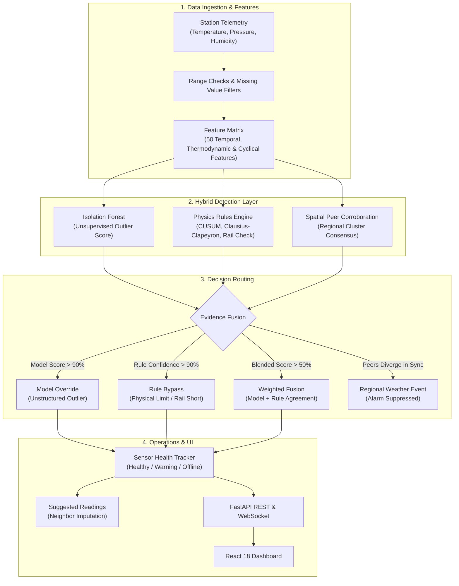
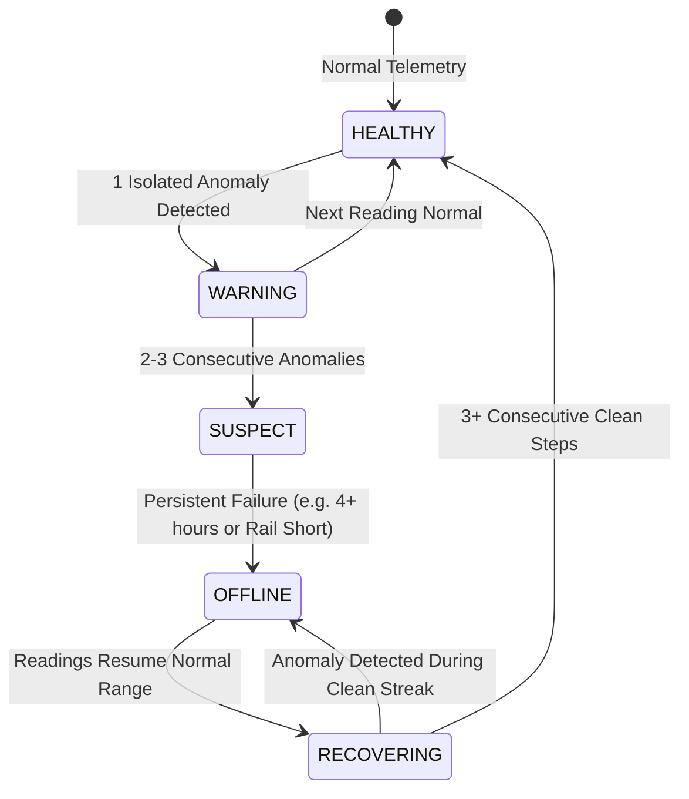

<div align="center">

# SkyGuard AI
### Autonomous Meteorological Telemetry Anomaly Detection for Distributed Automatic Weather Station (AWS) Networks

[](https://www.python.org/)
[](https://fastapi.tiangolo.com/)
[](https://reactjs.org/)
[](https://www.typescriptlang.org/)
[](https://www.docker.com/)
[](https://opensource.org/licenses/MIT)
[](https://github.com/psf/black)

[**Live Dashboard**](http://localhost:5173) • [**API Docs**](http://localhost:8000/docs) • [**Architecture Blueprint**](docs/BACKEND_BLUEPRINT.md) • [**Evaluation Script**](model/evaluate.py)

</div>

---

## 📌 Table of Contents

- [Overview](#-overview)
- [The Problem](#-the-problem)
- [How It Works](#-how-it-works)
- [Key Features](#-key-features)
- [Detection Pipeline Architecture](#-detection-pipeline-architecture)
- [Empirical Benchmark Results](#-empirical-benchmark-results)
- [Repository Structure](#-repository-structure)
- [Getting Started](#-getting-started)
  - [Option 1: Docker Compose (Recommended)](#option-1-docker-compose-recommended)
  - [Option 2: Local Development Setup](#option-2-local-development-setup)
- [Running the Evaluation Benchmark](#-running-the-evaluation-benchmark)
- [API Reference](#-api-reference)
- [Sensor Health State Machine](#-sensor-health-state-machine)
- [License](#-license)

---

## 🌍 Overview

**SkyGuard AI** is an anomaly detection and data quality monitoring system built for distributed networks of **Automatic Weather Stations (AWS)**. It identifies physical sensor faults, calibration drift, communication dropouts, and atmospheric inconsistencies in meteorological telemetry.

In operational weather monitoring, **ground-truth labels do not exist**. Severe natural weather events (such as sharp morning temperature transitions or sudden storm fronts) often resemble sensor faults. If a system relies purely on single-sensor thresholds, it triggers excessive false alarms during normal weather events.

SkyGuard AI addresses this with a **hybrid detection pipeline**:
1. **Unsupervised Outlier Detection** (Isolation Forest) to flag multivariate outliers without requiring pre-labeled training data.
2. **Physics-Informed Rules** (Clausius-Clapeyron saturation vapor pressure bounds, CUSUM diurnal rate-of-change checks, and electrical rail limits).
3. **Spatial Peer Corroboration** across 7 regional clusters (28 stations) to check whether neighboring stations observed the same event before flagging a sensor fault.

---

## ⚡ The Problem

| Fault Type | Physical Cause | Challenge with Simple Thresholds | SkyGuard AI Approach |
| :--- | :--- | :--- | :--- |
| **Calibration Drift** | Aging sensing elements or optical degradation cause slow systematic offset ($+0.1^\circ\text{C}/\text{hr}$). | Hard thresholds take days or weeks to trigger; naive CUSUM flags every morning sunrise. | **Diurnal Residual CUSUM + Peer Check**: Compares rate of change against seasonal diurnal baseline; checks if neighbors also moved. |
| **Frozen Value** | Telemetry freeze or stuck ADC converter. | Stuck sensors still show minor electronic thermal noise ($\pm 0.05^\circ\text{C}$), evading exact duplicate checks. | **Variance Window Check**: Detects near-zero variance during periods when surrounding weather is dynamic. |
| **Sensor Fail-Low** | Cable break or short circuit pulls analog input to electrical floor ($0.0\text{ ADC counts}$). | Fixed lower limits can confuse electrical dropouts with cold snaps. | **Hardware Rail Detection**: Verifies values pinned at physical limits ($-40^\circ\text{C}$, $0\text{ hPa}$, $0\%$) across multiple consecutive steps. |
| **Multivariate Inconsistency** | Sensor cross-talk, radiation shield damage, or internal heating issues. | Individual readings ($32^\circ\text{C}$, $85\%\text{ RH}$) look plausible in isolation. | **Clausius-Clapeyron Consistency**: Checks saturation vapor pressure curves; flags temperature increases accompanied by unphysical humidity rises. |
| **Unstructured Anomalies** | Power supply ripple, bridge degradation, or complex hardware noise. | No hand-crafted rule exists for arbitrary noise patterns. | **Unsupervised Isolation Depth**: Isolation Forest isolates points that violate joint parameter distributions ($T, P, RH, \text{ROC}$). |

---

## 🚀 Key Features

- **Unsupervised Anomaly Detection**: Isolation Forest trained on uncorrupted baseline weather data across 50 engineered rolling, rate-of-change, thermodynamic, and cyclical harmonic features.
- **Spatial Consensus**: 7 geographic clusters (Chennai, Delhi, Mumbai, Kolkata, Bhopal, Varanasi, Ranchi) cross-reference peer station movements, suppressing false alarms caused by regional fronts.
- **Explainability (SHAP & Decision Attribution)**: Exposes feature contributions for flagged anomalies so operators can inspect why an alert fired.
- **Sensor Health Tracking**: Tracks per-sensor state (`HEALTHY`, `WARNING`, `SUSPECT`, `OFFLINE`, `RECOVERING`) with streak requirements before taking sensors offline or recovering them.
- **Reading Imputation**: Computes fallback suggested readings using inverse-distance weighting from active cluster neighbors during sensor outages.
- **Live Dashboard**: React 18 dashboard with interactive map view, telemetry trend charts, alert lists, and simulation controls.

---

## 🏛️ Detection Pipeline Architecture



---

## 📊 Empirical Benchmark Results

Evaluated across all **28 stations** (60,480 rows total, 59,063 evaluated timesteps, 1,417 warm-up excluded) using the benchmark script ([`model/evaluate.py`](model/evaluate.py)):

### Summary Scorecard

```text
==========================================================================================
                   SKYGUARD AI — MULTI-STATION BENCHMARK EVALUATION
==========================================================================================
  Network Scope: 28 Automatic Weather Stations across 7 Microclimate Clusters
  Total Evaluated Timesteps: 59,063 (1,417 warm-up rows excluded)
  Detection Architecture: Unsupervised Isolation Forest + Physics Rules + Spatial Consensus
==========================================================================================
                                 EXECUTIVE SCORECARD
==========================================================================================
  Overall Precision:  87.3%    |  True Positives (TP):  2,147   |  False Positives (FP): 312    
  Overall Recall:     78.3%    |  False Negatives (FN): 595     |  True Negatives (TN):  56,009  
  Overall F1 Score:   0.826    |  Network Accuracy: 98.5%
==========================================================================================
```

### Breakdown by Injected Fault Type

| Fault Type | True Rows | Caught Rows | Precision | Recall | F1 Score | Notes |
| :--- | :---: | :---: | :---: | :---: | :---: | :--- |
| **Unstructured Anomaly** | 291 | 291 | Model-alone | **100.0%** | N/A | Caught by unsupervised Isolation Forest without hand-crafted rules |
| **Calibration Drift** | 1,494 | 1,215 | **84.2%** | **81.3%** | **0.828** | Peer corroboration suppressed 2,117 false alarms from regional weather |
| **Sensor Fail-Low** | 185 | 185 | 27.5% | **100.0%** | 0.431 | Pinned electrical floor detected; all events captured |
| **Multivariate Inconsistency** | 201 | 201 | 13.9% | **100.0%** | 0.244 | 100% of Clausius-Clapeyron violations identified |
| **Frozen Value** | 372 | 134 | 30.7% | 36.0% | 0.332 | **79.2% Episode Catch Rate (38/48 episodes caught)** |
| **Spike** | 199 | 121 | 32.0% | 60.8% | 0.419 | Requires reversion on subsequent step to filter natural pressure dips |

*(Note on frozen value recall: In real-time streaming, a sensor must stay flat for 3–4 consecutive steps before a frozen streak can be confirmed. This initial verification lag affects row-level recall, while the detector alarms on 79.2% of total frozen episodes).*

### Regional Cluster Performance

| Cluster Code | Region Description | Stations | True Faults | Alerts Sent | Precision | Recall | F1 Score |
| :---: | :--- | :---: | :---: | :---: | :---: | :---: | :---: |
| **BHO** | Bhopal (Central Plateau) | 4 | 545 | 453 | **91.6%** | 76.1% | 0.832 |
| **CHN** | Chennai (Coastal Humid) | 4 | 0 | 27 | Clean Baseline | 100% TN | Baseline |
| **DEL** | Delhi (Inland Semi-Arid) | 4 | 0 | 6 | Clean Baseline | 100% TN | Baseline |
| **KOL** | Kolkata (Gangetic Delta) | 4 | 530 | 475 | **89.5%** | 80.2% | 0.846 |
| **MUM** | Mumbai (Coastal Tropical) | 4 | 510 | 450 | **89.3%** | 78.8% | 0.837 |
| **RAN** | Ranchi (Chota Nagpur Plateau) | 4 | 1,157 | 1,040 | **87.0%** | 78.2% | 0.824 |
| **VAR** | Varanasi (Indo-Gangetic Plain) | 4 | 0 | 8 | Clean Baseline | 100% TN | Baseline |

---

## 📂 Repository Structure

```text
SkyGuardAI/
├── docker/                                # Docker container configurations
│   ├── Dockerfile.backend                 # Python 3.11 FastAPI image
│   ├── Dockerfile.frontend                # Multi-stage React build + Nginx image
│   └── nginx.conf                         # Reverse proxy configuration
├── model/                                 # Machine learning & detection logic
│   ├── evaluate.py                        # Benchmark evaluation pipeline
│   ├── detect.py                          # Real-time multi-stage anomaly detector
│   ├── features.py                        # Feature extraction functions
│   ├── train.py                           # Isolation Forest model training script
│   ├── simulator.py                       # Simulation loop for live / replay streaming
│   ├── state.py                           # Telemetry history buffer and state tracker
│   ├── explain.py                         # SHAP tree explainer module
│   ├── seasonal_baseline.py               # Diurnal expected rate-of-change models
│   └── fault_helper.py                    # ExtraTrees pattern helper
├── frontend/                              # React 18 TypeScript web dashboard
│   ├── src/                               # UI components, pages, hooks, and services
│   ├── package.json                       # Frontend dependencies
│   └── vite.config.ts                     # Vite build configuration
├── evaluation/                            # Secondary evaluation & data scripts
│   ├── run_fault_helper_eval.py           # Helper offline test script
│   ├── run_rules_only_eval.py             # Rule engine ablation script
│   ├── validate_data.py                   # Data validation check
│   └── fetch_uscrn_validation_slice.py    # USCRN reference data fetcher
├── scripts/                               # Maintenance & debug utilities
│   ├── debug/                             # Ad-hoc debug scripts
│   ├── patches/                           # Historical patch scripts
│   ├── keep_alive.py                      # Process supervisor script
│   └── view_db.py                         # SQLite database inspector
├── docs/                                  # Documentation and architectural specs
├── data/                                  # Historical weather CSVs & eval logs
├── model_artifacts/                       # Serialized models (.pkl)
├── config.py                              # Central configuration & thresholds
├── data_fetch.py                          # Open-Meteo archive data harvester
├── history_store.py                       # SQLite database for sensor history
├── main.py                                # FastAPI application entrypoint
├── requirements.txt                       # Backend Python dependencies
├── docker-compose.yml                     # Multi-container Docker compose definition
└── README.md                              # Project documentation
```

---

## 🚀 Getting Started

### Option 1: Docker Compose (Recommended)

Make sure [Docker Desktop](https://www.docker.com/products/docker-desktop/) is running, then start the services from the project root:

```bash
docker compose up --build
```

- **Dashboard:** [http://localhost:5173](http://localhost:5173) (or [http://localhost](http://localhost))
- **API Documentation:** [http://localhost:8000/docs](http://localhost:8000/docs)
- **Telemetry WebSocket:** `ws://localhost:8000/ws`

---

### Option 2: Local Development Setup

#### Prerequisites
- **Python 3.11+**
- **Node.js 20+** & **npm**

#### 1. Backend Setup
```bash
# Create and activate virtual environment
python -m venv .venv
source .venv/bin/activate  # On Windows: .venv\Scripts\activate

# Install dependencies
pip install -r requirements.txt

# Start FastAPI backend server
uvicorn main:app --host 0.0.0.0 --port 8000 --reload
```

#### 2. Frontend Setup
```bash
cd frontend

# Install dependencies
npm install

# Start development server
npm run dev
```

Open [http://localhost:5173](http://localhost:5173) in your browser.

---

## 🧪 Running the Evaluation Benchmark

To run the offline evaluation against all 28 labeled station datasets:

```bash
# Run the summary benchmark
python model/evaluate.py

# Run with per-station confusion matrices printed
python model/evaluate.py --verbose
```

Evaluation results and diagnostics are exported to `data/`:
- `data/eval_station_breakdown.csv`: Per-station metrics (TP, FP, FN, TN, precision, recall, F1).
- `data/eval_per_sensor_fault_log.csv`: Breakdown of every flagged reading by parameter and fault type.
- `data/eval_recovery_diagnostic.csv`: Recovery episode tracking.
- `data/eval_evidence_samples.csv`: Sample scores comparing model, rule, and fusion contributions.

---

## 🔌 API Reference

FastAPI provides an interactive OpenAPI / Swagger UI at `/docs`. Core endpoints include:

| Method | Endpoint | Description |
| :--- | :--- | :--- |
| `GET` | `/api/stations` | Returns current readings, health status, and coordinates for all 28 stations. |
| `GET` | `/api/anomalies/latest` | Returns recent anomaly detections with severity and decision route. |
| `GET` | `/api/sensor-health` | Returns per-parameter health states (`HEALTHY`, `WARNING`, `OFFLINE`). |
| `GET` | `/api/explain/{anomaly_id}` | Computes feature attribution for a flagged anomaly. |
| `GET` | `/api/suggested-reading/{id}` | Provides imputed reading with confidence bounds during sensor failure. |
| `POST` | `/api/inject-anomaly` | Starts replay mode with injected ground-truth faults for testing. |
| `POST` | `/api/repair-sensor` | Manually resets fault counters for a sensor parameter. |
| `WS` | `/ws` | Real-time WebSocket streaming live telemetry packets. |

---

## 🩺 Sensor Health State Machine

Sensor status is managed as a finite state machine:



---

## 📄 License

Distributed under the **MIT License**. See [`LICENSE`](LICENSE) for details.
