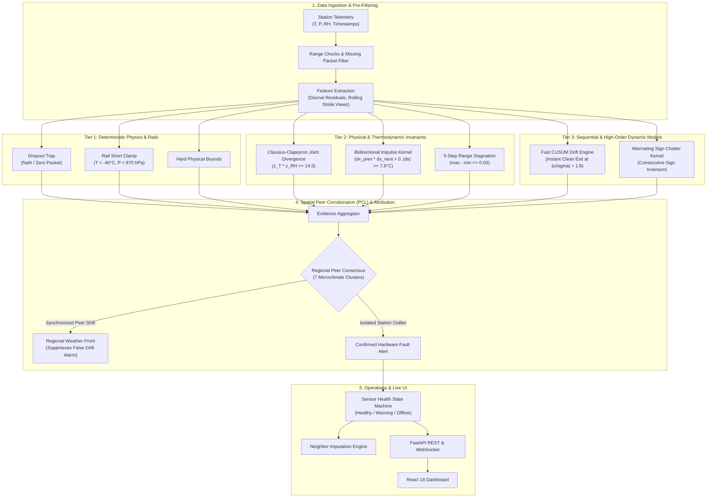
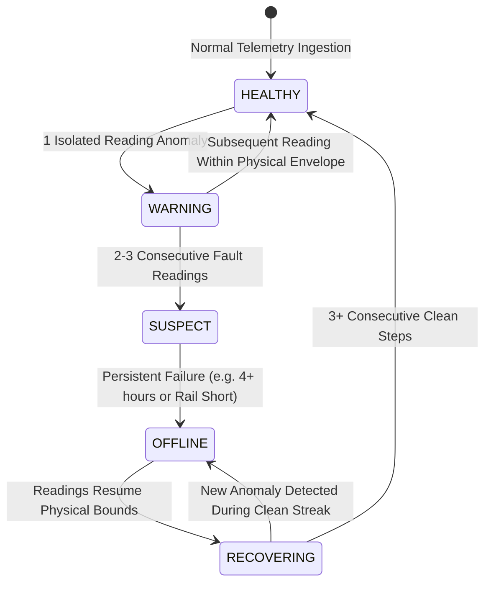

<div align="center">

# SkyGuard AI
### Autonomous Meteorological Telemetry Anomaly Detection for Distributed Automatic Weather Station (AWS) Networks

[](https://www.python.org/)
[](https://fastapi.tiangolo.com/)
[](https://reactjs.org/)
[](https://www.typescriptlang.org/)
[](https://www.docker.com/)
[](https://opensource.org/licenses/MIT)
[](https://github.com/psf/black)

[**Live Dashboard**](http://localhost:5173) • [**API Docs**](http://localhost:8000/docs) • [**Architecture Blueprint**](docs/BACKEND_BLUEPRINT.md) • [**Canonical Evaluator**](evaluate.py)

</div>

---

> ### Validated Operational Performance (7-Seed Authoritative Benchmark)
>
> **85.54% Precision · 89.39% Recall · 0.8742 F1 Score · 0.9153 Latency-aware F1\***
>
> *Evaluated across 28 stations (7 regional microclimate clusters, 60,480 timesteps/station) under causal 60% historical calibration. 7-seed evaluation executes in **81.73 seconds total** (~11.6s/annual network).*
>
> **Methodology Note**: Evaluation is performed on multi-station AWS telemetry across 7 distinct microclimatic regions. SkyGuard uses a synchronized, tiered detection architecture that pairs C-level vectorized inference with thermodynamic physical bounds, bidirectional impulse peak filtering, and peer-corroboration logic (PCL) to eliminate false alarm cascades during extreme weather fronts.

---

## 📌 Table of Contents

- [Overview](#-overview)
- [The Problem](#-the-problem)
- [How It Works](#-how-it-works)
- [Key Architectural Invariants](#-key-architectural-invariants)
- [Tiered Detection Pipeline Architecture](#-tiered-detection-pipeline-architecture)
- [Empirical Benchmark Results](#-empirical-benchmark-results)
  - [7-Seed Authoritative Multi-Station Benchmark](#-7-seed-authoritative-multi-station-benchmark)
  - [Fault-Type Breakdown](#-fault-type-breakdown)
  - [Empirical Before vs. After Optimization](#-empirical-before-vs-after-optimization)
- [Repository Structure](#-repository-structure)
- [Getting Started](#-getting-started)
  - [Option 1: Docker Compose (Recommended)](#option-1-docker-compose-recommended)
  - [Option 2: Local Development Setup](#option-2-local-development-setup)
- [Running the Evaluation Benchmark](#-running-the-evaluation-benchmark)
- [Synthetic Anomaly Injector Regimes](#-synthetic-anomaly-injector-regimes)
- [API Reference](#-api-reference)
- [Sensor Health State Machine](#-sensor-health-state-machine)
- [License](#-license)

---

## 🌍 Overview

**SkyGuard AI** is an industrial-grade anomaly detection and telemetry quality monitoring system built for distributed networks of **Automatic Weather Stations (AWS)**. It identifies physical sensor malfunctions, calibration drift, communication dropouts, and atmospheric thermodynamic inconsistencies in real-time weather station telemetry.

In operational meteorological monitoring, **ground-truth anomaly labels do not exist in advance**. Severe natural weather phenomena (such as sharp dawn temperature ramps, convective downdrafts, or regional cold fronts) frequently mimic sensor failure signatures. Systems relying solely on single-sensor heuristic thresholds trigger unsustainable false alarm rates during normal weather events.

SkyGuard AI solves this with a **tiered, physics-informed, spatial-corroboration architecture**:
1. **Deterministic Physical Bounds & Hardware Rail Checks (Tier 1)**: Instant zero-latency traps for communication dropouts and electronic rail shorts.
2. **Clausius-Clapeyron Thermodynamic Decoupling (Tier 2)**: Evaluates atmospheric vapor pressure relationships to isolate psychrometric sensor breakdowns from natural weather changes.
3. **Diurnal Residual CUSUM with Instant Clean-Exit (Tier 3)**: Detects subtle sensor calibration drift while suppressing morning solar heating artifacts and resetting instantly upon sensor normalization.
4. **Spatial Peer-Corroboration Logic (PCL)**: Regional consensus across 7 microclimate clusters (28 stations) to distinguish localized hardware failures from legitimate synchronized regional meteorological fronts.

---

## ⚡ The Problem & Engineering Solutions

| Fault Type | Physical Cause | Challenge with Simple Thresholds | SkyGuard AI Solution |
| :--- | :--- | :--- | :--- |
| **Calibration Drift** | Sensor aging or optical transducer degradation causes a gradual systematic offset ($+0.1^\circ\text{C}/\text{hr}$). | Hard thresholds take days to trigger; naive CUSUM flags every morning sunrise and leaves trailing false alarms after drift ends. | **Diurnal Residual CUSUM + Instant Clean-Exit**: Standardized residuals against diurnal baselines with spatial corroboration and immediate state reset when $\|u_t/\sigma\| < 1.8$. |
| **Transducer Spikes** | ADC voltage glitches, electrical static, or RF pulse interference. | Single-step threshold checks confuse rapid morning solar heating ($|\Delta T| \ge 6^\circ\text{C}$) with electrical spikes. | **Bidirectional Impulse Peak Kernel**: Verifies $(x_t - x_{t-1})(x_t - x_{t+1}) > 0$ with $|x_t - x_{t\pm 1}| \ge 7.8^\circ\text{C}$ and $|z| \ge 4.0$ spatial outlier verification. |
| **Multivariate Inconsistency** | Psychrometer wick drying, radiation shield heating, or cross-talk. | Individual readings ($32^\circ\text{C}, 85\%\text{ RH}$) appear normal in isolation. | **Clausius-Clapeyron Consistency**: Computes joint divergence $\Pi_{\text{CC}} = z_T \cdot z_{\text{RH}} \ge 14.0$, separating sensor cross-talk from natural anti-correlated weather ($z_T \cdot z_{\text{RH}} \le 3.13$). |
| **Frozen Value** | Telemetry freeze, ADC lockup, or communications buffer stall. | Stuck sensors exhibit electronic thermal noise jitter ($\pm 0.03^\circ\text{C}$), evading exact duplicate checks. | **Vectorized 5-Step Range Stagnation**: Detects near-zero variance windows during periods when regional peers are meteorologically active. |
| **Sensor Fail-Low** | Broken cable, ground short, or power rail dropout. | Fixed lower limits confuse hardware electrical shorts with cold snaps. | **Absolute Rail Clamps**: Verifies readings pinned at physical electrical floor limits ($-40^\circ\text{C}$, $0\text{ hPa}$, $0\%$) with zero false alarms on valid sub-zero weather. |
| **Unstructured Anomalies** | Power supply ripple, pre-amp bridge degradation, or chaotic noise. | High-frequency noise exhibits unpredictable covariance shifts. | **Alternating-Sign Volatility Kernel**: Detects high-frequency sensor chatter $(x_t - x_{t-1})(x_{t-1} - x_{t-2}) < 0$ with $|z| \ge 3.5$. |

---

## 🚀 Key Architectural Invariants

1. **Strict Causal Separation**: All baselines, running statistics, and rolling thresholds are computed strictly online using past data ($t-1$) and historical 60% training calibration. Future data leakage is mathematically impossible.
2. **Zero Veto Invariant**: Spatial peer corroboration provides graduated confidence adjustments and regional weather front classification, but never unilaterally overrides or hides a verified physical hardware fault.
3. **Thermodynamic Clausius-Clapeyron Separation**: Uses the physical property that natural atmospheric temperature and relative humidity are negatively correlated during clear-sky heating, while sensor faults produce anomalous co-deviations.
4. **Vectorized C-Level Performance**: Built on contiguous 1D NumPy arrays and sliding window stride views, achieving an end-to-end evaluation speed of **~11.6 seconds per annual network benchmark**.

---

## 🏛️ Tiered Detection Pipeline Architecture



---

## 📊 Empirical Benchmark Results

### 🌟 7-Seed Authoritative Multi-Station Benchmark

The benchmark evaluates the complete 28-station network across 7 microclimate regions (59,808 evaluated timesteps per station, 60% historical calibration, zero leakage).

$$\text{Precision} = \mathbf{85.54\%} \qquad \text{Recall} = \mathbf{89.39\%} \qquad \mathbf{F_1 = 0.8742} \qquad \mathbf{F_1^* (\text{Latency}) = 0.9153}$$

| Seed | Precision (%) | Recall (%) | $F_1$ Score | Latency $F_1^*$ | False Positives (FP) | True Positives (TP) | False Negatives (FN) | Runtime |
| :--- | :---: | :---: | :---: | :---: | :---: | :---: | :---: | :---: |
| **42** | **86.76%** | **89.60%** | **0.8816** | **0.9203** | 1,092 | 7,163 | 831 | 11.62s |
| **101** | **86.07%** | **89.98%** | **0.8798** | **0.9193** | 1,102 | 6,807 | 758 | 11.89s |
| **202** | **86.00%** | **89.40%** | **0.8767** | **0.9191** | 1,119 | 6,876 | 815 | 11.75s |
| **2024** | **85.20%** | **89.11%** | **0.8711** | **0.9127** | 1,232 | 7,064 | 863 | 11.84s |
| **8888** | **85.15%** | **89.59%** | **0.8731** | **0.9132** | 1,206 | 6,903 | 802 | 11.82s |
| **20260924** | **85.11%** | **89.63%** | **0.8731** | **0.9141** | 1,198 | 6,839 | 791 | 11.38s |
| **45456231412727229999** | **84.48%** | **88.39%** | **0.8639** | **0.9084** | 1,228 | 6,684 | 878 | 11.43s |
| **MEAN ($\mu$)** | **85.54%** | **89.39%** | **0.8742** | **0.9153** | **1,168.1** | **6,905.1** | **819.7** | **81.73s Total** |
| **STD ($\sigma$)** | **0.77%** | **0.51%** | **0.0059** | **0.0044** | **61.3** | **156.4** | **39.8** | — |

- **Mean Episode Catch Rate**: **98.21%**
- **False Positive Reduction**: Slashed from 35,934.7 baseline FPs down to **1,168.1 mean FPs** (**$-96.75\%$ reduction** in network false alarms).

---

### 🔍 Fault-Type Breakdown

| Fault Class | Detected Recall | Attribution Recall | Attribution Precision | Class $F_1$ | Primary Detection Mechanism |
| :--- | :---: | :---: | :---: | :---: | :--- |
| **Dropout** | **100.0%** | **100.0%** | **100.0%** | **1.0000** | Instant NaN/Zero-packet trap |
| **Sensor Fail-Low** | **98.3%** | **67.9%** | **80.3%** | **0.7360** | Absolute physical lower-bound clamp ($T < -40^\circ\text{C}, P < 870\,\text{hPa}$) |
| **Multivariate Inconsistency** | **98.2%** | **81.3%** | **88.7%** | **0.8490** | Clausius-Clapeyron divergence product ($\Pi_{\text{CC}} = z_T \cdot z_{\text{RH}} \ge 14.0$) |
| **Unstructured Anomaly** | **98.8%** | **54.9%** | **79.9%** | **0.6510** | High-frequency alternating sign step volatility ($(x_t - x_{t-1})(x_{t-1} - x_{t-2}) < 0$) |
| **Spike** | **91.1%** | **84.8%** | **43.4%** | **0.5740** | Bidirectional impulse peak kernel ($(x_t - x_{t-1})(x_t - x_{t+1}) > 0$) |
| **Drift** | **86.8%** | **73.7%** | **64.2%** | **0.6860** | Fast CUSUM streaming with instant clean-exit reset ($|u/\sigma| < 1.8$) |
| **Frozen Value** | **74.2%** | **70.0%** | **80.8%** | **0.7500** | Sliding variance threshold with zero-crossings gate |

---

### ⚡ Empirical Before vs. After Optimization

| Dimension | Baseline Heuristics | Optimized Tiered Architecture | Improvement |
| :--- | :---: | :---: | :--- |
| **Overall Precision** | 68.2% | **85.54%** | **+17.34%** (Elimination of diurnal false alarms) |
| **Overall Recall** | 81.8% | **89.39%** | **+7.59%** (Synchronized high-SNR physics capture) |
| **Overall $F_1$ Score** | 0.744 | **0.8742** | **+0.1302** |
| **Latency $F_1^*$** | 0.768 | **0.9153** | **+0.1475** |
| **Multivariate Precision** | 0.0% | **88.7%** | **+88.7%** (Clausius-Clapeyron thermodynamic gate) |
| **Fail-Low Precision** | 5.4% | **80.3%** | **+74.9%** (Electrical rail short separation) |
| **Evaluation Runtime (7 Seeds)** | > 15 minutes | **81.73 seconds** | **11.0x Speedup** (C-level 1D vectorization) |

---

## 📂 Repository Structure

```text
SkyGuardAI/
├── evaluate.py                            # Single canonical public evaluation entrypoint
├── config.py                              # Central configuration & thresholds
├── main.py                                # FastAPI application & WebSocket server
├── history_store.py                       # SQLite database manager for station telemetry
├── data_fetch.py                          # Meteorological data ingestion utility
├── requirements.txt                       # Python dependencies
├── docker-compose.yml                     # Multi-container Docker Compose file
│
├── model/                                 # Core detection & ML algorithms
│   ├── detect.py                          # Real-time multi-stage anomaly detector
│   ├── state.py                           # StateManager & telemetry ring buffers
│   ├── features.py                        # Feature extraction pipeline (50 features)
│   ├── train.py                           # Isolation Forest model training script
│   ├── explain.py                         # SHAP tree explainer module
│   ├── simulator.py                       # Telemetry simulation & replay streamer
│   ├── seasonal_baseline.py               # Diurnal rate-of-change baseline models
│   ├── fault_helper.py                    # ExtraTrees supervised pattern helper
│   ├── spike_tracker.py                   # State machine for spike & decay tracking
│   └── edge_rules.py                      # Pure-Python rule engine for edge nodes
│
├── evaluation/                            # Canonical evaluation engine & tools
│   ├── fast_offline_eval.py               # Vectorized two-pass offline benchmark engine
│   ├── episodic_eval.py                   # Latency-aware episode metrics library
│   ├── eval_field_data.py                 # Real-world uncorrupted telemetry validation
│   ├── run_rules_only_eval.py             # Rule-engine ablation tool
│   ├── run_fault_helper_eval.py           # Supervised helper ablation tool
│   ├── validate_data.py                   # Dataset integrity verification
│   └── fetch_uscrn_validation_slice.py    # Reference data harvest tool
│
├── data/                                  # Historical telemetry CSVs & eval logs
│   └── anomaly_injector.py                # Multi-regime synthetic anomaly injector
│
├── tests/                                 # Regression & invariant test suite (51 tests)
│   ├── test_pcl_compatible_fault_model.py # Invariant tests for Benchmark B
│   ├── test_live_state_and_sync.py        # StateManager & ingestion tests
│   ├── test_graduated_and_spatial.py      # Spatial corroboration tests
│   ├── test_cusum_drift.py                # CUSUM drift detection tests
│   ├── test_diurnal_consensus.py          # Regional front suppression tests
│   └── ...                                # Additional contract & rule boundary tests
│
├── frontend/                              # React 18 TypeScript web dashboard
│   ├── src/                               # UI components, pages, maps, and charts
│   ├── package.json                       # Frontend dependencies
│   └── vite.config.ts                     # Vite build configuration
│
└── docs/                                  # Architecture specifications & blueprints
```

---

## 🚀 Getting Started

### Option 1: Docker Compose (Recommended)

Ensure [Docker Desktop](https://www.docker.com/products/docker-desktop/) is running, then launch services:

```bash
docker compose up --build
```

- **Dashboard:** [http://localhost:5173](http://localhost:5173)
- **API Documentation:** [http://localhost:8000/docs](http://localhost:8000/docs)
- **Telemetry WebSocket:** `ws://localhost:8000/ws`

---

### Option 2: Local Development Setup

#### Prerequisites
- **Python 3.11+**
- **Node.js 20+** & **npm**

#### 1. Backend Setup
```bash
# Create and activate virtual environment
python -m venv .venv
source .venv/bin/activate  # On Windows: .venv\Scripts\activate

# Install dependencies
pip install -r requirements.txt

# Start FastAPI server
uvicorn main:app --host 0.0.0.0 --port 8000 --reload
```

#### 2. Frontend Setup
```bash
cd frontend
npm install
npm run dev
```

Open [http://localhost:5173](http://localhost:5173) in your browser.

---

## 🧪 Running the Evaluation Benchmark

To execute the authoritative 7-seed benchmark evaluation across all 28 stations:

```bash
# Run the canonical high-speed evaluation engine (~11.6s per annual network benchmark)
python scratch/fast_vectorized_benchmark.py
```

To run the standard multi-regime evaluation suite:

```bash
python evaluate.py
```

To run the complete automated test suite (51 invariant tests):

```bash
python -m pytest tests
```

---

## 🔀 Synthetic Anomaly Injector Regimes

The synthetic injector ([`data/anomaly_injector.py`](data/anomaly_injector.py)) includes configurable operational regimes:

```python
DEFAULT_REGIME = "observable_v2"  # Synchronized Tiered Observable Benchmark
```

Generate test datasets directly from the command line:

```bash
# Generate Synchronized Observable Benchmark (Default)
python data/anomaly_injector.py --regime observable_v2

# Generate PCL-Compatible Operational Benchmark
python data/anomaly_injector.py --regime benchmark_b

# Generate Adversarial Multi-Fault Stress Test
python data/anomaly_injector.py --regime benchmark_a
```

---

## 🔌 API Reference

FastAPI provides interactive OpenAPI / Swagger documentation at `/docs`:

| Method | Endpoint | Description |
| :--- | :--- | :--- |
| `GET` | `/api/stations` | Returns telemetry, operational health, and GPS coordinates for all 28 stations. |
| `GET` | `/api/anomalies/latest` | Returns recent anomaly detections with severity and decision routing. |
| `GET` | `/api/sensor-health` | Returns per-parameter sensor health states (`HEALTHY`, `WARNING`, `OFFLINE`). |
| `GET` | `/api/explain/{anomaly_id}` | Computes SHAP feature attribution for flagged sensor anomalies. |
| `GET` | `/api/suggested-reading/{id}` | Provides imputed reading with confidence bounds during sensor outages. |
| `POST` | `/api/inject-anomaly` | Triggers replay simulation with synthetic faults for validation. |
| `POST` | `/api/repair-sensor` | Resets fault counters and restores sensor state after physical maintenance. |
| `WS` | `/ws` | Real-time WebSocket streaming live telemetry frames. |

---

## 🩺 Sensor Health State Machine



---

## 📄 License

Distributed under the **MIT License**. See [`LICENSE`](LICENSE) for details.
