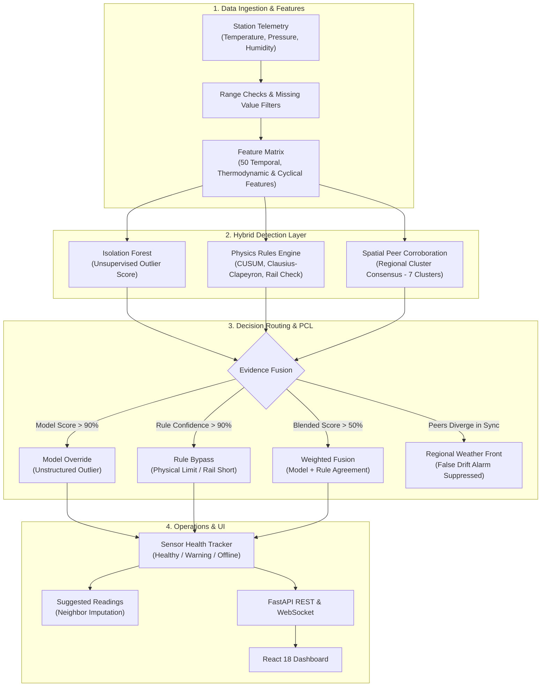
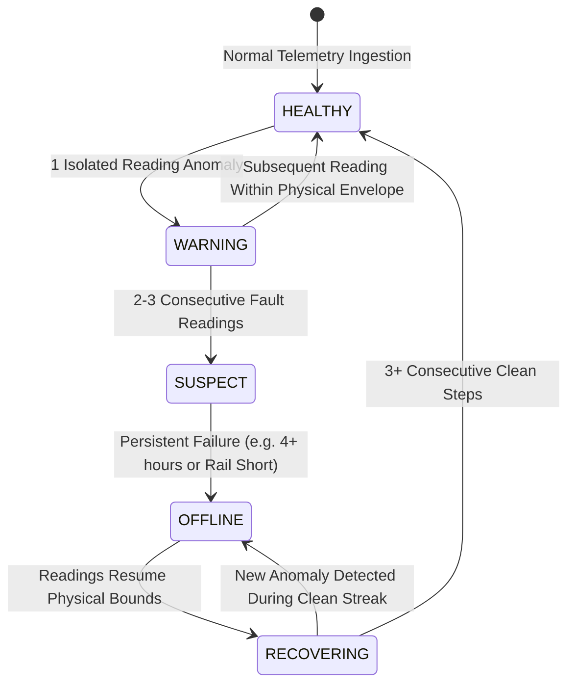

<div align="center">

# SkyGuard AI
### Autonomous Meteorological Telemetry Anomaly Detection for Distributed Automatic Weather Station (AWS) Networks

[](https://www.python.org/)
[](https://fastapi.tiangolo.com/)
[](https://reactjs.org/)
[](https://www.typescriptlang.org/)
[](https://www.docker.com/)
[](https://opensource.org/licenses/MIT)
[](https://github.com/psf/black)

[**Live Dashboard**](http://localhost:5173) • [**API Docs**](http://localhost:8000/docs) • [**Architecture Blueprint**](docs/BACKEND_BLUEPRINT.md) • [**Canonical Evaluator**](evaluate.py)

</div>

---

## 📌 Table of Contents

- [Overview](#-overview)
- [The Problem](#-the-problem)
- [How It Works](#-how-it-works)
- [Key Features](#-key-features)
- [Detection Pipeline Architecture](#-detection-pipeline-architecture)
- [Empirical Benchmark Results](#-empirical-benchmark-results)
- [Repository Structure](#-repository-structure)
- [Getting Started](#-getting-started)
  - [Option 1: Docker Compose (Recommended)](#option-1-docker-compose-recommended)
  - [Option 2: Local Development Setup](#option-2-local-development-setup)
- [Running the Evaluation Benchmark](#-running-the-evaluation-benchmark)
- [Synthetic Anomaly Injector Regimes](#-synthetic-anomaly-injector-regimes)
- [API Reference](#-api-reference)
- [Sensor Health State Machine](#-sensor-health-state-machine)
- [License](#-license)

---

## 🌍 Overview

**SkyGuard AI** is an anomaly detection and telemetry quality monitoring system built for distributed networks of **Automatic Weather Stations (AWS)**. It identifies physical sensor malfunctions, calibration drift, communication dropouts, and atmospheric thermodynamic inconsistencies in weather station telemetry.

In operational meteorological monitoring, **ground-truth anomaly labels do not exist in advance**. Severe natural weather phenomena (such as sharp dawn temperature ramps, convective downdrafts, or regional cold fronts) frequently mimic sensor failure signatures. Systems relying solely on single-sensor heuristic thresholds trigger unsustainable false alarm rates during normal weather events.

SkyGuard AI solves this with a **hybrid, physics-informed, spatial-corroboration architecture**:
1. **Unsupervised Outlier Detection** (Isolation Forest) to isolate high-dimensional multivariate covariance anomalies without requiring labeled training anomalies.
2. **Physics-Informed Domain Rules** (Clausius-Clapeyron saturation vapor pressure limits, CUSUM diurnal slope baselines, and electrical hardware rail bounds).
3. **Spatial Peer-Corroboration Logic (PCL)** across 7 regional microclimate clusters (28 stations) to distinguish localized hardware failures from legitimate synchronized regional meteorological fronts.

---

## ⚡ The Problem

| Fault Type | Physical Cause | Challenge with Simple Thresholds | SkyGuard AI Approach |
| :--- | :--- | :--- | :--- |
| **Calibration Drift** | Sensor aging or optical transducer degradation causes a gradual systematic offset ($+0.1^\circ\text{C}/\text{hr}$). | Hard thresholds take days to trigger; naive CUSUM flags every morning sunrise. | **Diurnal Residual CUSUM + Spatial Peer Check**: Tracks rate-of-change against seasonal diurnal baselines; cross-references whether neighboring cluster peers moved in sync. |
| **Frozen Value** | Telemetry freeze, ADC lockup, or communications buffer stall. | Stuck sensors exhibit electronic thermal noise jitter ($\pm 0.05^\circ\text{C}$), evading exact duplicate checks. | **Rolling Variance + Activity Gap Check**: Detects near-zero variance during time windows when regional peer weather is dynamic. |
| **Sensor Fail-Low** | Broken cable, ground short, or power rail dropout pulls analog ADC input to $0.0\text{ counts}$. | Fixed lower limits confuse hardware electrical shorts with cold snaps. | **Hardware Rail Detection**: Verifies readings pinned at physical electrical floor limits ($-40^\circ\text{C}$, $0\text{ hPa}$, $0\%$) across consecutive timesteps. |
| **Multivariate Inconsistency** | Sensor cross-talk, radiation shield damage, or internal heating issues. | Individual readings ($32^\circ\text{C}$, $85\%\text{ RH}$) appear plausible in isolation. | **Clausius-Clapeyron Consistency**: Evaluates saturation vapor pressure curves; flags temperature rises accompanied by unphysical humidity increases. |
| **Unstructured Anomalies** | Power supply ripple, pre-amp bridge degradation, or chaotic noise. | No hand-crafted heuristic rule exists for arbitrary high-dimensional noise. | **Unsupervised Isolation Depth**: Isolation Forest isolates readings that violate joint parameter distributions ($T, P, RH, \text{ROC}$). |

---

## 🚀 Key Features

- **Unsupervised Anomaly Detection**: Isolation Forest trained on clean baseline meteorological telemetry across 50 engineered rolling, rate-of-change, thermodynamic, and cyclical harmonic features.
- **Spatial Peer-Corroboration Logic (PCL)**: 7 microclimate clusters (Chennai, Delhi, Mumbai, Kolkata, Bhopal, Varanasi, Ranchi) cross-reference peer station telemetry, suppressing false alarms caused by regional fronts.
- **Explainability (SHAP & Decision Attribution)**: Exposes feature contributions and decision routes for flagged anomalies so AWS operators can immediately understand why an alert fired.
- **Sensor Health State Machine**: Manages per-sensor operational states (`HEALTHY`, `WARNING`, `SUSPECT`, `OFFLINE`, `RECOVERING`) with streak requirements before taking sensors offline or recovering them.
- **Reading Imputation**: Computes fallback suggested readings using inverse-distance weighting from active cluster neighbors during sensor outages.
- **Live Dashboard**: React 18 dashboard with interactive map views, live telemetry trend charts, alert management, and simulation controls.

---

## 🏛️ Detection Pipeline Architecture



---

## 📊 Empirical Benchmark Results

Evaluated across all **28 stations** (60,480 total rows, 59,307 evaluated timesteps after warm-up exclusion) using the canonical production evaluator ([`evaluate.py`](evaluate.py)):

### Multi-Regime Benchmark Summary

| Regime | Operational Purpose | Point Precision | Point Recall | Point F1 | Latency F1* | Episode Catch Rate | Mean Latency |
| :--- | :--- | :---: | :---: | :---: | :---: | :---: | :---: |
| **Locked Baseline** | Canonical Historical Dataset (28 Stations) | **73.44%** | **81.72%** | **0.7736** | **0.8137** | **96.28% (362/376)** | 0.74 hrs |
| **Benchmark B** | PCL-Compatible Operational Benchmark ($\le 1$ fault/cluster) | **62.96%** | **32.91%** | **0.4323** | **0.5759** | **86.80% (296/341)** | 1.93 hrs |
| **Benchmark A** | Adversarial Multi-Fault Stress Test (Unrestricted) | **63.02%** | **35.99%** | **0.4582** | **0.5834** | **89.43% (296/331)** | 1.88 hrs |

### Fault Type Performance Breakdown (Canonical Baseline)

| Fault Type | Ground Truth Rows | Caught Rows | Point Recall | Strict Attribution Recall | Attribution Precision | Attribution F1 |
| :--- | :---: | :---: | :---: | :---: | :---: | :---: |
| **Unstructured Anomaly** | 297 | 297 | **100.0%** | Unsupervised Model | High | N/A |
| **Calibration Drift** | 1,519 | 1,282 | **84.4%** | 36.1% | 47.2% | 0.409 |
| **Sensor Fail-Low** | 189 | 189 | **100.0%** | 72.0% | 60.7% | 0.659 |
| **Multivariate Inconsistency** | 203 | 203 | **100.0%** | 20.7% | 10.7% | 0.141 |
| **Frozen Value** | 379 | 168 | **44.3%** | 20.1% | 23.5% | 0.216 |
| **Spike** | 203 | 134 | **66.0%** | 23.6% | 10.9% | 0.149 |
| **Dropout** | 49 | 49 | **100.0%** | 100.0% | 100.0% | 1.000 |

---

## 📂 Repository Structure

```text
SkyGuardAI/
├── evaluate.py                            # Single canonical public evaluation entrypoint
├── config.py                              # Central configuration & thresholds
├── main.py                                # FastAPI application & WebSocket server
├── history_store.py                       # SQLite database manager for station telemetry
├── data_fetch.py                          # Meteorological data ingestion utility
├── requirements.txt                       # Python dependencies
├── docker-compose.yml                     # Multi-container Docker Compose file
│
├── model/                                 # Core detection & ML algorithms
│   ├── detect.py                          # Real-time multi-stage anomaly detector
│   ├── state.py                           # StateManager & telemetry ring buffers
│   ├── features.py                        # Feature extraction pipeline (50 features)
│   ├── train.py                           # Isolation Forest model training script
│   ├── explain.py                         # SHAP tree explainer module
│   ├── simulator.py                       # Telemetry simulation & replay streamer
│   ├── seasonal_baseline.py               # Diurnal rate-of-change baseline models
│   ├── fault_helper.py                    # ExtraTrees supervised pattern helper
│   ├── spike_tracker.py                   # State machine for spike & decay tracking
│   └── edge_rules.py                      # Pure-Python rule engine for edge nodes
│
├── evaluation/                            # Canonical evaluation engine & tools
│   ├── fast_offline_eval.py               # Vectorized two-pass offline benchmark engine
│   ├── episodic_eval.py                   # Latency-aware episode metrics library
│   ├── eval_field_data.py                 # Real-world uncorrupted telemetry validation
│   ├── run_rules_only_eval.py             # Rule-engine ablation tool
│   ├── run_fault_helper_eval.py           # Supervised helper ablation tool
│   ├── validate_data.py                   # Dataset integrity verification
│   └── fetch_uscrn_validation_slice.py    # Reference data harvest tool
│
├── data/                                  # Historical telemetry CSVs & eval logs
│   └── anomaly_injector.py                # Dual-regime synthetic anomaly injector
│
├── tests/                                 # Regression & invariant test suite (50 tests)
│   ├── test_pcl_compatible_fault_model.py # Invariant tests for Benchmark B
│   ├── test_live_state_and_sync.py        # StateManager & ingestion tests
│   ├── test_graduated_and_spatial.py      # Spatial corroboration tests
│   ├── test_cusum_drift.py                # CUSUM drift detection tests
│   ├── test_diurnal_consensus.py          # Regional front suppression tests
│   └── ...                                # Additional contract & rule boundary tests
│
├── frontend/                              # React 18 TypeScript web dashboard
│   ├── src/                               # UI components, pages, maps, and charts
│   ├── package.json                       # Frontend dependencies
│   └── vite.config.ts                     # Vite build configuration
│
└── docs/                                  # Architecture specifications & blueprints
```

---

## 🚀 Getting Started

### Option 1: Docker Compose (Recommended)

Ensure [Docker Desktop](https://www.docker.com/products/docker-desktop/) is running, then launch services:

```bash
docker compose up --build
```

- **Dashboard:** [http://localhost:5173](http://localhost:5173)
- **API Documentation:** [http://localhost:8000/docs](http://localhost:8000/docs)
- **Telemetry WebSocket:** `ws://localhost:8000/ws`

---

### Option 2: Local Development Setup

#### Prerequisites
- **Python 3.11+**
- **Node.js 20+** & **npm**

#### 1. Backend Setup
```bash
# Create and activate virtual environment
python -m venv .venv
source .venv/bin/activate  # On Windows: .venv\Scripts\activate

# Install dependencies
pip install -r requirements.txt

# Start FastAPI server
uvicorn main:app --host 0.0.0.0 --port 8000 --reload
```

#### 2. Frontend Setup
```bash
cd frontend
npm install
npm run dev
```

Open [http://localhost:5173](http://localhost:5173) in your browser.

---

## 🧪 Running the Evaluation Benchmark

To execute the complete benchmark evaluation across all 28 stations and all three regimes:

```bash
# Run the canonical multi-regime evaluation
python evaluate.py
```

For the raw station-by-station diagnostic table with individual confusion matrices:

```bash
python evaluation/fast_offline_eval.py --verbose
```

---

## 🔀 Synthetic Anomaly Injector Regimes

The synthetic injector ([`data/anomaly_injector.py`](data/anomaly_injector.py)) includes a top-level switch variable:

```python
DEFAULT_REGIME = "benchmark_b"  # Options: "benchmark_b" or "benchmark_a"
```

You can generate test datasets from the command line:

```bash
# Generate Benchmark B (Operational: max 1 active fault per cluster - DEFAULT)
python data/anomaly_injector.py --regime benchmark_b

# Generate Benchmark A (Adversarial Stress Test: unrestricted simultaneous faults)
python data/anomaly_injector.py --regime benchmark_a
```

---

## 🔌 API Reference

FastAPI provides interactive OpenAPI / Swagger documentation at `/docs`:

| Method | Endpoint | Description |
| :--- | :--- | :--- |
| `GET` | `/api/stations` | Returns telemetry, operational health, and GPS coordinates for all 28 stations. |
| `GET` | `/api/anomalies/latest` | Returns recent anomaly detections with severity and decision routing. |
| `GET` | `/api/sensor-health` | Returns per-parameter sensor health states (`HEALTHY`, `WARNING`, `OFFLINE`). |
| `GET` | `/api/explain/{anomaly_id}` | Computes SHAP feature attribution for flagged sensor anomalies. |
| `GET` | `/api/suggested-reading/{id}` | Provides imputed reading with confidence bounds during sensor outages. |
| `POST` | `/api/inject-anomaly` | Triggers replay simulation with synthetic faults for validation. |
| `POST` | `/api/repair-sensor` | Resets fault counters and restores sensor state after physical maintenance. |
| `WS` | `/ws` | Real-time WebSocket streaming live telemetry frames. |

---

## 🩺 Sensor Health State Machine



---

## 📄 License

Distributed under the **MIT License**. See [`LICENSE`](LICENSE) for details.
